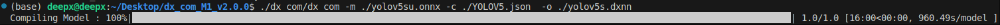

# Convert AI Models to DeepX Format and Validate Accuracy in Three Steps

English | [中文](./README_zh.md)

## Project Overview

This project is an example of a **general, framework-agnostic method**: assessing whether a model conversion succeeds by comparing the consistency of two models’ outputs. We provide an end-to-end example converting the **YOLOv5su** model from PyTorch (.pt) to ONNX (.onnx) and compiling to the DeepX-specific .dxnn format. Finally, we use a **model output analysis script** to run inference on a standard test image (test.jpg) and compare outputs between the .dxnn and original .pt models to verify conversion fidelity. The approach itself applies to any toolchain and hardware target.


## Workflow

### 1. Environment Setup

First, make sure you have the full DeepX SDK installed.

For installation instructions, refer to the official DeepX SDK repository:

https://github.com/DEEPX-AI/dx-all-suite#

The SDK includes the following core components:

- **DX-Compiler**: Compiles standard ONNX models into .dxnn optimized for DeepX hardware.
- **DX-Runtime**: An inference engine for efficiently loading and executing .dxnn models on device.
- **DX-Profiler**: A performance analysis tool that provides detailed runtime metrics on hardware.
- **DX-Model-Zoo**: A collection of pre-optimized models to help you get started quickly.

### 2. Model Format Conversion

The conversion consists of two steps:

#### Step 1. Convert PyTorch (.pt) to ONNX (.onnx)

Use the convert.py script to export the official yolov5su.pt model to ONNX:

```bash
python convert.py
```

The script will load the model and save it to ./model/yolov5su.onnx. Note: we set the batch size to 1 to ensure the DeepX toolchain can compile it correctly.


#### Step 2. Convert ONNX (.onnx) to DXNN (.dxnn)

Next, use the DeepX DX-Compiler to convert the ONNX model to .dxnn. This step performs optimizations for the target hardware.

```bash
PATH_TO_DEEPX_COM/dx_com/dx_com \
                -m ./model/yolov5su.onnx \
                -o ./model/yolov5su.dxnn \
                -c ./model/yolov5su.json
```

After compilation, you will get yolov5su.dxnn for inference.



### 3. Output Similarity Analysis

Finally, run the yolo_analysis.py script. It loads both the .pt and .dxnn models, performs inference on test.jpg, and measures the similarity between their outputs.

```bash
python yolo_analysis.py
```

The script prints detailed analysis results. We use the following core metrics to comprehensively assess conversion fidelity:

#### Key Metrics Explained

1. **Cosine Similarity**
   - What it measures: The directional similarity between two vectors, independent of their magnitude.
   - Why it matters: Values closer to 1 indicate the .dxnn output is aligned in direction with the .pt output. This shows the feature pattern is preserved even if there is a global scale change.
   - It is a widely used standard for feature similarity and is robust to quantization-related scaling.

2. **Pearson Correlation Coefficient**
   - What it measures: The strength of the linear relationship between two sets of values.
   - Why it matters: Values closer to 1 indicate a strong positive linear relationship. For example, when the original model’s output increases at a position, the converted model’s output also increases accordingly.
   - Useful to verify whether the trend of outputs remains consistent after conversion.

3. **Structural Similarity (SSIM)**
   - What it measures: Originally designed for images, we apply the concept to 1D feature vectors to jointly evaluate mean (luminance), variance (contrast), and covariance (structure).
   - Why it matters: Values closer to 1 indicate the converted model preserves the statistical characteristics of the original output.
   - Offers a richer perspective than basic error metrics by capturing structural fidelity.

4. **Mean Squared Error (MSE) & Mean Absolute Error (MAE)**
   - What they measure: Classic metrics for absolute numerical differences between two outputs.
   - Why they matter: Values closer to 0 indicate the two outputs are numerically closer, implying minimal accuracy loss.
   - Provide a direct, quantitative view of conversion-induced error.

Together, these metrics provide a comprehensive, multi-angle evaluation so we can judge conversion success scientifically and objectively.


---

When deploying AI models to edge devices, ensuring that a converted model maintains output consistency while achieving high performance is critical. We hope this standardized, automated evaluation workflow offers AI engineers a reliable way to quickly validate whether a conversion has succeeded.

---

Project repository: https://github.com/Chris-godz/Deepx-Yolo-Compile

Community: Issues and PRs are welcome.

Disclaimer: The YOLOv5 model used in this project is copyrighted by its original authors. DeepX SDK tools are copyrighted by DEEPX.

---

This document showcases a complete practice in model conversion and accuracy verification. If you have any questions or suggestions, we’d love to hear from you!
