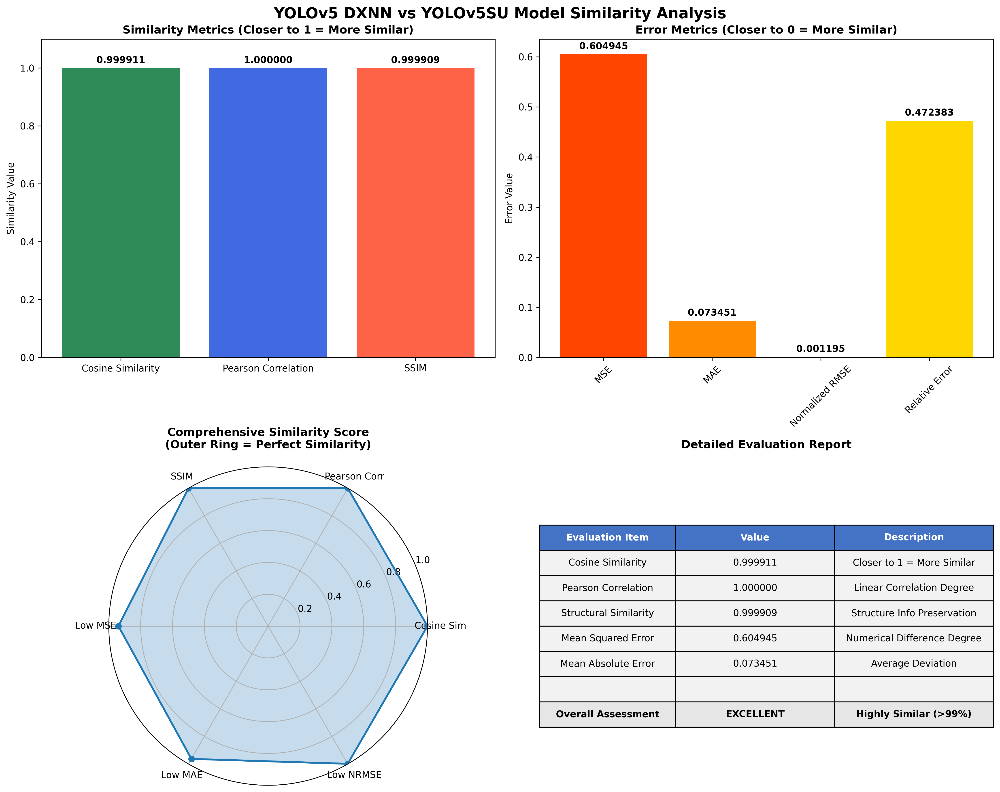
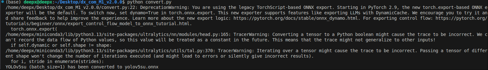
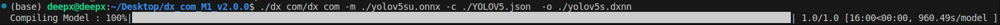
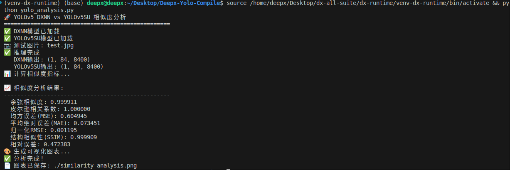

# 三步将AI模型转换为 DeepX 格式并完成精度评估

[English](./README.md) | 中文

## 项目简介

本项目采用了一种**通用、与框架无关的方法**的范例：通过比较两种模型输出的一致性，来判断一次模型转换是否成功。我们提供了一个端到端示例，演示如何将 **YOLOv5su** 模型从 PyTorch (`.pt`) 转换为 ONNX (`.onnx`)，再编译为 DeepX 专用的 `.dxnn` 格式。最后 采用 **模型输出结果分析脚本**，通过对标准测试图片 (`test.jpg`) 进行推理，分析 `.dxnn` 模型与原始 `.pt` 模型输出的结果是否一致，体现模型在转换过程中是否成功。



## 工作流

### 1. 环境准备

首先，确保你已经安装好了 DeepX 完整的 SDK。

具体的安装可以参考 DeepX 的官方 SDK Repo:

https://github.com/DEEPX-AI/dx-all-suite#

该 SDK 主要包含以下几个核心模块：

- **DX-Compiler**: 模型编译器，负责将标准的 ONNX 模型转换为针对 DeepX 硬件优化的 `.dxnn` 格式。
- **DX-Runtime**: 推理引擎，用于在硬件上高效加载和执行 `.dxnn` 模型。
- **DX-Profiler**: 性能分析工具，可以详细分析模型在硬件上运行时的各项性能指标。
- **DX-Model-Zoo**: 提供了一系列预优化好的模型，方便用户快速上手和测试。

### 2. 模型格式转换

转换过程分为两个步骤：

#### 第一步. 将 PyTorch (`.pt`) 格式模型 转换为 ONNX (`.onnx`) 格式模型

我们使用 `convert.py` 脚本将官方的 `yolov5su.pt` 模型导出为 ONNX 格式。

```bash
python convert.py
```

该脚本会自动加载模型，并将其保存到 `./model/yolov5su.onnx`。注意: 这里我们的 Batch Size 设置为 1，以确保 DeepX 工具可以正确编译



#### 第二步. 将 ONNX (`.onnx`) 格式模型 转换为 DXNN (`.dxnn`) 格式模型

接下来，使用 DeepX 提供的 DX-Compiler 编译工具将 ONNX 模型转换为 `.dxnn` 格式。此步骤会针对特定硬件进行优化。

```bash
PATH_TO_DEEPX_COM/dx_com/dx_com \
                -m ./model/yolov5su.onnx \
                -o ./model/yolov5su.dxnn \
                -c ./model/yolov5su.json
```
编译完成后，我们得到了最终用于推理的 `yolov5su.dxnn` 模型。



### 3. 模型输出相似度分析

最后，运行 `yolo_analysis.py` 脚本，它会同时加载 `.pt` 和 `.dxnn` 模型，对 `test.jpg` 图片进行推理，得到 `.dxnn`模型与原始 `.pt` 模型输出的结果之间的相似度。

```bash
python yolo_analysis.py
```

脚本执行后会输出详细的分析结果。我们选用了以下几个核心指标来全方位评估模型转换的保真度：

#### 关键评估指标详解

1.  **余弦相似度 (Cosine Similarity)**
    *   **代表什么**: 衡量两个向量在方向上的差异，而不关心它们的绝对大小。
    *   **意义**: 结果越接近 **1**，表示 `.dxnn` 模型与 `.pt` 模型输出的特征向量在**方向上越一致**。这说明即使数值存在整体缩放，但特征模式得到了很好的保留。
    *   它是评估深度学习模型特征相似性的黄金标准，能有效忽略编译优化可能带来的量化尺度变化。

2.  **皮尔逊相关系数 (Pearson Correlation)**
    *   **代表什么**: 衡量两个数据集合之间的**线性相关程度**。
    *   **意义**: 结果越接近 **1**，表示两个模型的输出值之间存在越强的**正向线性关系**。例如，如果原始模型某个位置的输出值变大，转换后的模型也应该相应变大。
    *   用于判断模型转换后，输出值的变化趋势是否与原始模型保持了高度一致。

3.  **结构相似性 (SSIM)**
    *   **代表什么**: 一种最初用于衡量图像相似度的指标，我们将其思想应用于一维特征向量，综合评估均值（亮度）、方差（对比度）和协方差（结构）的相似性。
    *   **意义**: 结果越接近 **1**，表示转换后的模型输出在**统计特性上与原始模型越相似**，结构保持得越好。
    *   它比传统的误差指标更能从统计学角度评估输出的保真度，提供了更丰富的比较维度。

4.  **均方误差 (MSE) & 平均绝对误差 (MAE)**
    *   **代表什么**: 衡量两个模型输出值之间**绝对数值差异**的经典指标。
    *   **意义**: 结果越接近 **0**，表示两个模型的输出在**数值上越接近**，精度损失越小。
    *   它们是最直接、最量化的精度评估方式，直观反映了模型转换引入的误差大小。

这些指标共同构成了一个全面的评估体系，确保我们能从多个角度科学、客观地判断模型转换是否成功。



---

在AI模型部署到边缘设备的过程中，如何确保转换后的模型在保持高性能的同时，又能维持与原始模型输出的一致性，是一个至关重要的问题。我们相信，通过本项目提供的这套标准化、自动化的评估流程，能够为AI工程师提供一个可靠的工具，快速评估模型转换是否成功。

---

**项目地址**：https://github.com/Chris-godz/Deepx-Yolo-Compile

**技术交流**：欢迎提交Issue或PR，共同完善这套评估体系。

**声明**：本项目中使用的YOLOv5模型版权归属原作者，DeepX SDK相关工具版权归属DEEPX公司。

---

*这篇文档展示了我们在模型转换和精度验证方面的一次完整实践。如果您有任何问题或建议，欢迎随时与我们交流！*

